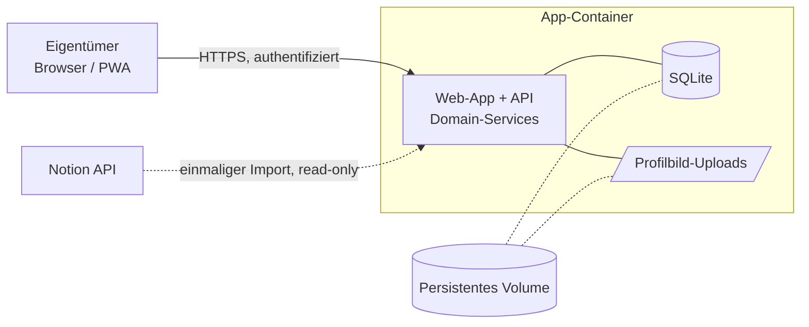

# 1. Projektübersicht – RelaTable

> Zentrale Orientierung. Verlinkt direkt in die Detailartefakte. ↩ [Index](README.md)

## Produktvision

RelaTable ist eine private, selbst gehostete Webanwendung für **genau einen** Eigentümer, die persönliche Beziehungen strukturiert erfasst und als **Graph**, **Timeline** und **Karte** sichtbar macht. Sie verwaltet Personen, Beziehungen, Beziehungsverläufe, Beziehungstagebuch-Einträge und gemeinsame Ereignisse – inklusive korrekt historisierter Zeiträume.

## Zielgruppe & Benutzerkontext

- **Eine** technisch versierte Person als alleiniger Eigentümer und Betreiber.
- Nutzung über Desktop, Tablet und Smartphone.
- Betrieb lokal oder auf einem eigenen VPS, ein App-Container mit persistentem Volume.
- Daten sind **hochsensibel** (intime Ereignisse, private Accounts, Beziehungsverläufe).

## Kernproblem

Persönliche Beziehungen, ihre Entwicklung über die Zeit und gemeinsame Erlebnisse lassen sich in Notiz-Tools nicht konsistent historisieren, nicht als Netzwerk erkunden und nicht geografisch oder chronologisch auswerten – ohne dabei sensible Daten an Dritte zu geben.

## V1-Ziele

1. Personen mit Profil, Adresse (optional) und mehreren Social Accounts verwalten.
2. Connections (ungeordnetes Personenpaar) mit historisierten Beziehungstypen führen.
3. Beziehungsregeln (Nähegrad, Freundschaft Plus, Romantik, Ex-Partner/in) korrekt durchsetzen – siehe [Beziehungsregeln](07_beziehungsregeln.md).
4. Ereignisse (inkl. `Sex` als eigener Typ) mit Teilnehmern und Ort erfassen.
5. Timeline global, pro Person und pro Paar darstellen – inkl. **ungenauer** Zeitangaben.
6. Hauptgraph + fokussierter Graph (nur direkte Kontakte), bedienbar per Klick/Doppelklick/Long-Press **und** sichtbarer Aktion.
7. Pair-Detailansicht über Klick auf eine Graphkante.
8. Kartenansicht mit getrennten Layern Personen/Ereignisse, Clustering, Stadt/Region genügt.
9. Vernetzungs-Finder: gemeinsame **direkte** Kontakte zweier Personen.
10. Einmaliger, kontrollierter Notion-Initialimport (Vorschau → Ausführung).
11. Einstellungen für Beziehungs-/Ereignistypen, Theme (System/Light/Dark), Backup/Restore.
12. Vollständige Zugriffskontrolle, responsive Bedienung, automatisierte Tests.

## Nicht-Ziele (V1)

- Beziehungstemperatur / Aktivitätswert (**ganz gestrichen**, siehe [RISK](09_risiko-register.md)).
- Historischer Graph-Zeitregler (Modell speichert Zeiträume trotzdem korrekt).
- Mehrbenutzer / Mandanten / Gastzugriff / Share-Links.
- Laufender Notion-Sync (Schreiben nach Notion).
- Externe KI-Verarbeitung sensibler Daten (`AiNote` bleibt reines Textfeld).
- Pfadsuche im Finder (nur gemeinsame direkte Kontakte).

## Bestätigte Produktentscheidungen

| ID | Entscheidung |
| --- | --- |
| DEC-001 | Ein globaler Eigentümer-Account; keine Mehrmandantenfähigkeit. |
| DEC-002 | Eigene **SQLite**-Datenbank; ein App-Container + persistentes Volume. |
| DEC-003 | Notion ist Spezifikations- und **einmalige** Importquelle, kein laufender Sync. |
| DEC-004 | Eine Connection = genau ein **ungeordnetes** Personenpaar; kein Duplikat. |
| DEC-005 | Beziehungstypen werden über **Zeiträume** historisiert; Historie wird nie überschrieben. |
| DEC-006 | Nähegrad-Stufen sind exklusiv & geordnet (Bekanntschaft < Freundschaft < Enge Freundschaft). |
| DEC-007 | Freundschaft Plus ist andauernd und darf parallel zum Nähegrad bestehen; `Sex` ist ein Ereignis und ändert den Status nicht automatisch. |
| DEC-008 | Romantische Beziehung blockiert den Nähegrad und beendet aktiven Nähegrad + Freundschaft Plus bei Start. |
| DEC-009 | Beim Beenden einer Romantik: Dialog für Folge-Nähegrad und optional `Ex-Partner/in` (paralleler Folgestatus). |
| DEC-010 | Ereignisse sind fachlich unabhängig von Beziehungen; gemeinsame Events werden über **gemeinsame Teilnehmer** ermittelt. |
| DEC-011 | Profilbilder: lokaler Upload **und** externe HTTPS-URL. |
| DEC-012 | Standort: Stadt/Region genügt; Karte funktioniert ohne exakte Adresse. |
| DEC-013 | Ungenaue Zeitangaben (Tag/Monat/Jahr/Jahreszeit/ungefähr/unbekannt); UI täuscht keine exakten Tage vor. |
| DEC-014 | Alter wird berechnet, nie redundant gespeichert. |
| DEC-015 | Theme: drei Werte `System`/`Light`/`Dark`. |
| DEC-016 | Kein Gastzugriff in V1. |
| DEC-017 | Fokussierter Graph zeigt nur direkte Kontakte (Tiefe 1). |
| DEC-018 | Auth: Cookie-Session (HttpOnly/Secure) + Argon2id; 2FA später. |
| DEC-019 | Stack: SvelteKit + TypeScript, Prisma + SQLite, Cytoscape.js, **Google Maps** (Fallback Leaflet/OSM), Docker. |
| DEC-020 | Deployment: Docker-Image **nur für VPS**; lokales Debugging auch **ohne** Docker (nativ, lokale SQLite-Datei). |
| DEC-021 | Geschlecht: optionales Feld mit Werten **Männlich / Weiblich / divers**. |
| DEC-022 | Pair-Filter „nur exakt diese zwei" = Event mit genau diesen beiden Teilnehmern. |
| DEC-023 | Parallele Kontexttypen (Cosplay/Business) sind **frei anlegbar** in den Einstellungen. |
| DEC-024 | Notion-Import: alles Wichtige (Person/Relation/Event/Account), Bilder als URL. |
| DEC-025 | Karte: **Google Maps** bevorzugt (kostenloser Tier, Key+Billing nötig); Fallback OSM/Leaflet (keyless). |
| DEC-030 | Beziehungstemperatur ersatzlos gestrichen (Out of Scope). |

Decision Log wird in [10_offene-entscheidungen.md](10_offene-entscheidungen.md) fortgeführt; verworfene Varianten bleiben dokumentiert.

## Technische Zielarchitektur

**Gewählter Stack (DEC-019, entschieden):** durchgehend **TypeScript**, weil Graph + Karte JS-Bibliotheken erfordern.

- **Runtime/Framework:** Node.js 22 LTS + **SvelteKit** (adapter-node) — ein schlankes Single-Node-Deployable, ideal für eine selbst gehostete Single-Container-App mit kleinem VPS-Footprint. *(Runner-up dokumentiert: Next.js.)*
- **ORM/DB:** **Prisma + SQLite** (better-sqlite3) + Prisma Migrate (versionierte Migrationen).
- **Validierung:** **Zod** als Single Source Client/Server (NFR-004).
- **Auth:** Cookie-Session (HttpOnly/Secure) + **Argon2id**, Session-Store in SQLite (DEC-018).
- **Graph:** **Cytoscape.js** · **Karte:** **Google Maps JS API** + @googlemaps/markerclusterer (bevorzugt, DEC-025); **Fallback Leaflet/OSM** (keyless). Provider-Abstraktion einplanen.
- **UI/Theme:** Tailwind CSS, System/Light/Dark (DEC-015).
- **Tests:** Vitest (Domain), Playwright (E2E).
- **Betrieb (DEC-020):** **VPS** über ein Multi-Stage Docker-Image (node:22-alpine, non-root) + persistentes Volume `/data` (SQLite + Uploads), HTTPS via Reverse-Proxy. **Lokales Debugging ohne Docker** (`npm run dev`/node, lokale SQLite-Datei); identische Konfiguration über ENV.
- Trennung Domain / API / UI (NFR-004); Beziehungsregeln als isoliert testbarer Domain-Service.

## Datenschutz- & Sicherheitsprinzipien

- Keine Fachdaten ohne Authentifizierung – UI **und** direkte API-Aufrufe geschützt.
- Passwörter nur mit aktuellem Hashing-Verfahren; Sessions/Tokens mit Ablauf & Widerruf.
- Sensible Felder (intime Ereignisse, private Accounts, Notizen) besonders geschützt.
- Standort grob (Stadt/Region) als Standard; keine exakten Privatadressen erzwungen.
- Logs ohne Passwörter, Tokens, intime Notizen oder vollständige Personendatensätze.
- Produktion nur über HTTPS. Upload-Validierung (Typ/Größe). Schutz gegen XSS/CSRF/Injection.

## Deploymentziel

**VPS:** ein Docker-Image + persistentes Volume. **Lokal:** native Ausführung ohne Container (lokale SQLite-Datei) für Debugging. Identische Konfiguration über ENV. Dokumentiertes Backup-/Restore-Verfahren (siehe [EPIC-012](02_epics.md#epic-012--backup-restore--betrieb)). (DEC-020)

## Definition of Done (Projektebene)

Eine Anforderung ist erst fertig, wenn: Akzeptanzkriterien erfüllt · Build & statische Prüfungen grün · Unit-/Integrationstests grün · kritische UI-Flows per Playwright geprüft · Migrationen erstellt & getestet · Sicherheits-/Berechtigungsprüfung erfolgt · responsive geprüft · Doku & Beispielkonfiguration aktualisiert · nachvollziehbare Commits · keine undokumentierten Annahmen. Details: [Testmodell folgt in Review 2/§10 des Prompts].

## Offene Entscheidungen & Risiken (Einstieg)

- Offene fachliche/technische Entscheidungen: [10_offene-entscheidungen.md](10_offene-entscheidungen.md)
- Risiken: [09_risiko-register.md](09_risiko-register.md)

## Verknüpfte Artefakte

[Epics](02_epics.md) · [Feature-Landkarte](03_feature-landkarte.md) · [Scope-Matrix](04_scope-matrix.md) · [Sitemap](05_sitemap.md) · [Datenmodell](06_datenmodell.md) · [Beziehungsregeln](07_beziehungsregeln.md) · [Dependency Map](08_dependency-map.md) · [Mockup-Plan](11_mockup-plan.md)
