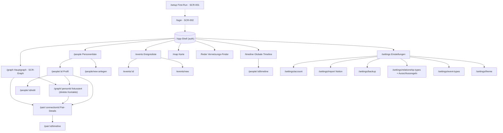

# 5. Sitemap & Informationsarchitektur

> ↩ [Index](README.md) · Screens → [Mockup-Plan](11_mockup-plan.md) · Features → [Landkarte](03_feature-landkarte.md)

Die Anwendung wirkt **datenorientiert, aber nicht wie ein technisches Admin-Tool**. Eine konsistente Shell trägt Hauptnavigation (Desktop) bzw. Tab-/Drawer-Navigation (Mobil).

## Hauptnavigation (immer erreichbar)

`Graph` · `Personen` · `Ereignisse` · `Timeline` · `Karte` · `Finder` · `Einstellungen`

## Zusätzliche Bereiche (unter Einstellungen / Account)

`Profil/Account` · `Import` · `Backup/Restore` · `Beziehungstypen & Kategorien` · `Ereignistypen` · `Theme`

## Sitemap

## Navigationsvarianten (Detail in [UX-Empfehlungen, Review 2])

- **Desktop:** persistente Seitenleiste (Empfehlung) vs. Top-Bar – siehe Prompt §8.1.
- **Smartphone:** Bottom-Tab-Bar für die 5 wichtigsten Bereiche (Graph, Personen, Ereignisse, Karte, Mehr), restliche unter „Mehr"/Drawer – siehe Prompt §8.2. SCR-004.

## Breadcrumb / Zurück-Verhalten

- Fokuswechsel im Graph und Pair-Details ändern die URL (Deep-Link), sodass Browser-Zurück den vorherigen Kontext wiederherstellt (GRF-002).
- Mobile Detailseiten/Bottom-Sheets besitzen eine **sichtbare** Zurück-Aktion, nicht nur Wischen.

## Deep-Link-Struktur (stabil, kommentierbar)

| Muster | Zweck |
|---|---|
| `/people/:id` | Personenprofil |
| `/graph/:personId` | fokussierter Graph einer Person |
| `/pair/:connectionId` | Pair-Detailansicht eines Paars |
| `/events/:id` | Ereignisdetail |
| `/timeline?from=&to=&type=` | gefilterte globale Timeline |
| `/map?layer=people,events` | Karte mit Layer-Auswahl |
| `/finder?a=:id&b=:id` | Finder-Ergebnis |

## Screen → Feature/Flow-Zuordnung (Auszug)

| Screen | Features | Flows |
|---|---|---|
| SCR-001 First-Run | FEAT-001 | FLOW-01 |
| SCR-002 Login | FEAT-002 | FLOW-02 |
| SCR-003 Nav Desktop | FEAT-120 | – |
| SCR-004 Nav Smartphone | FEAT-120, FEAT-055 | FLOW-20 |
| Personenliste | FEAT-010/011 | FLOW-03 |
| Personenprofil | FEAT-012/014/015/016 | FLOW-03…06, FLOW-16 |
| Hauptgraph | FEAT-050…052 | FLOW-17, FLOW-18 |
| Fokus-Graph | FEAT-053/054 | FLOW-19, FLOW-23 |
| Pair-Details | FEAT-060…064 | FLOW-21, FLOW-22 |
| Beziehungsdialoge | FEAT-021…026 | FLOW-08…12 |
| Ereignis/Timeline | FEAT-040…046 | FLOW-10, FLOW-14/15 |
| Karte | FEAT-070…074 | FLOW-24 |
| Finder | FEAT-080/081 | FLOW-25 |
| Import | FEAT-090…093 | FLOW-26 |
| Backup | FEAT-110/111 | FLOW-27 |

> Vollständige Screen-Liste (`SCR-xxx`) wird in der Mockup-Runde vergeben – siehe [11_mockup-plan.md](11_mockup-plan.md).
