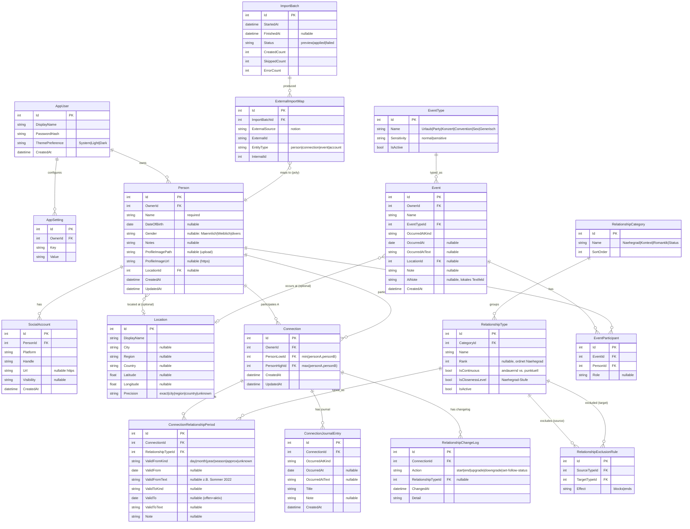
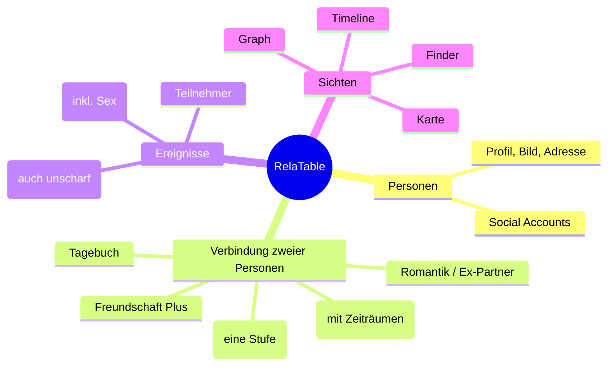
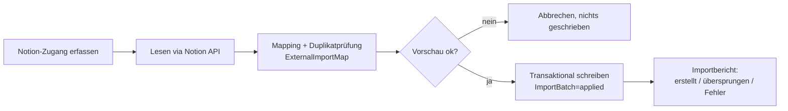
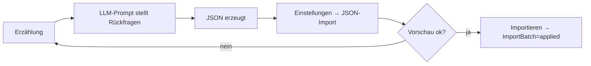

# 6. Datenmodell & Mermaid-ER-Diagramm

> ↩ [Index](README.md) · Regeln: [Beziehungsregeln](07_beziehungsregeln.md) · Container: [Projektübersicht](01_projektuebersicht.md#technische-zielarchitektur)

Konsistentes logisches Modell auf SQLite. Es deckt alle vom Masterprompt geforderten Entitäten ab und speichert historische Zeiträume **korrekt**, auch ohne historischen Graph-Zeitregler in V1.

## 6.1 Entitäten (Überblick)

| Entität | Zweck |
| --- | --- |
| AppUser | Der **eine** Eigentümer-Account (Auth, Theme). |
| Person | Personenstammdaten. |
| SocialAccount | 0..n Accounts je Person (einzige Quelle der Wahrheit). |
| Connection | **Ungeordnetes** Personenpaar (genau 2, eindeutig). |
| RelationshipCategory | Gruppierung von Beziehungstypen (z. B. Nähegrad, Kontext, Romantik). |
| RelationshipType | Konfigurierbarer Typ (Bekanntschaft, Freundschaft, …, Freundschaft Plus, Romantik, Ex-Partner/in, Cosplay, Business). |
| RelationshipExclusionRule | Welche Typen einander ausschließen/beenden. |
| ConnectionRelationshipPeriod | Historisierter Zeitraum eines Typs auf einer Connection. |
| ConnectionJournalEntry | Beziehungstagebuch-Eintrag. |
| RelationshipChangeLog | Audit der Statuswechsel. |
| EventType | Konfigurierbarer Ereignistyp (Urlaub, Party, Konzert, Convention, `Sex`, generisch …) + Sensitivität. |
| Event | Ereignis (fachlich unabhängig von Beziehungen). |
| EventParticipant | Teilnehmer (1..n) eines Events. |
| Location | Ort (Stadt/Region genügt, optionale Koordinaten + Präzision). |
| ImportBatch | Ein einmaliger Notion-Importlauf. |
| ExternalImportMap | Mapping externer Notion-IDs → interne IDs (Duplikatschutz). |
| AppSetting | Schlüssel/Wert-App-Einstellungen. |

## 6.2 Mermaid-ER-Diagramm

## 6.3 Datenmodellregeln (Constraints)

- **C-MODEL-1:** `Connection` ist **ungeordnet** → kanonische Speicherung als `PersonLowId < PersonHighId`; **Unique(OwnerId, PersonLowId, PersonHighId)** verhindert doppelte Paare (DEC-004).
- **C-MODEL-2:** `PersonLowId ≠ PersonHighId` (keine Selbstkante).
- **C-MODEL-3:** Höchstens **ein** aktiver Nähegrad-Period (offen `ValidTo`) je Connection (DEC-006); App-Service + partieller Unique-Index.
- **C-MODEL-4:** Statuswechsel **schließt** alten Period (`ValidTo` setzen) und legt neuen an – nie UPDATE des Typs in place (DEC-005).
- **C-MODEL-5:** `Event` braucht **≥1** `EventParticipant`.
- **C-MODEL-6:** Alle Fachdaten tragen `OwnerId` des einzigen `AppUser` (Vorbereitung, kein Mehrmandanten-Feature).
- **C-MODEL-7:** Profilbild: `ProfileImagePath` **oder** `ProfileImageUrl` (URL nur HTTPS), beide optional.
- **C-MODEL-8:** Alter wird **berechnet** aus `DateOfBirth` (DEC-014) – keine Alters-Spalte.
- **C-MODEL-9:** Ungenaue Zeit überall als Paar `*Kind` + (`date` **oder** `*Text`); UI rendert gemäß `Kind`, täuscht keinen exakten Tag vor (DEC-013).
- **C-MODEL-10:** `ExternalImportMap` Unique(ExternalSource, ExternalId) → kein Doppelimport (FEAT-092).
- **C-MODEL-11:** Zeitstempel intern UTC; reine Kalendertage als reine Datumswerte ohne künstliche Uhrzeit.
- **C-MODEL-12:** Löschverhalten über FK + Domainregeln; vor dem Löschen Abhängigkeiten anzeigen (FEAT-013).

## 6.4 Vereinfachtes fachliches Modell (für Nicht-Techniker)

## 6.5 Abgeleitete Timeline = Projektion

Die Timeline (global/Person/Pair) ist eine **Projektion** über `ConnectionRelationshipPeriod`, `RelationshipChangeLog`, `ConnectionJournalEntry` und `Event`(+Participants) – **keine** zusätzliche, duplizierte Datenquelle. Gemeinsame Events eines Paars werden über **gemeinsame Teilnehmer** ermittelt (DEC-010), nicht gespeichert.

## 6.6 Weitere geforderte Diagramme (Verweise)

- **Zustandsdiagramm Beziehungswechsel:** in [07_beziehungsregeln.md](07_beziehungsregeln.md#zustandsdiagramm).
- **System-/Containerdiagramm:** in [01_projektuebersicht.md](01_projektuebersicht.md#technische-zielarchitektur).
- **Notion-Import-Ablauf:**

- **JSON-Import (Erzählung → Datenbank):** In den Einstellungen lassen sich Personen, Verbindungen (mit historisiertem Verlauf) und Ereignisse aus einem JSON-Objekt einpflegen. Personen werden per `ref`/Name referenziert; „Vorschau" prüft transaktional und macht zurück (schreibt nichts), „Importieren" schreibt und protokolliert via `ImportBatch`. Schema + LLM-Prompt zum Erzeugen des JSON: [`docs/import/`](../import/json-schema.md).

> **Optionaler nächster Schritt:** Dieses Modell kann zusätzlich als interaktives **DataModelLM** (`.datamodel`) angelegt werden. Sag Bescheid, dann erzeuge ich es aus diesem ER-Stand.
