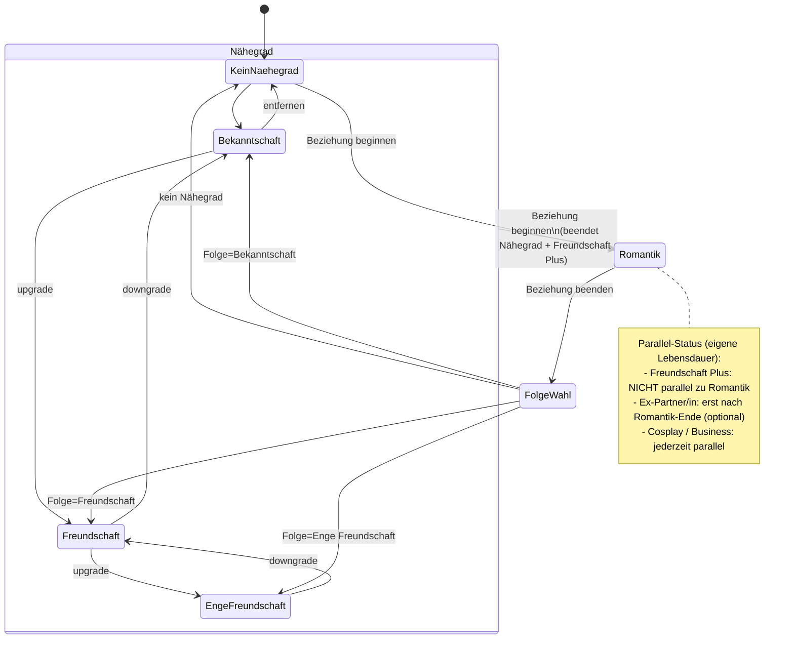

# 7. Beziehungsregeln / Relationship Rules

> ↩ [Index](README.md) · Datenmodell: [06_datenmodell.md](06_datenmodell.md) · Features: FEAT-020…FEAT-026, FEAT-042 · Flows: FLOW-08…FLOW-12

Verbindliche Fachlogik für Connections. Implementierung als **isoliert testbarer Domain-Service** (NFR-004). Alle Wechsel **historisieren** über `ConnectionRelationshipPeriod` + `RelationshipChangeLog` – Historie wird nie überschrieben.

## Begriffe

- **Nähegrad** – exklusive, geordnete Stufen: `Bekanntschaft` (1) < `Freundschaft` (2) < `Enge Freundschaft` (3). Höchstens **eine** Stufe zu einem Zeitpunkt aktiv.
- **Freundschaft Plus** – andauernder Typ, **parallel** zum Nähegrad erlaubt.
- **Romantische Beziehung** – andauernder Typ, **blockiert** den Nähegrad.
- **Ex-Partner/in** – paralleler **Folgestatus** nach Romantik-Ende.
- **Sex** – ein **Ereignis** (EventType), kein Beziehungstyp; ändert Status nie automatisch.
- **Parallele Kontexte** – z. B. `Cosplay`, `Business`: bestehen unabhängig weiter, auch während Romantik.

## Zustandsdiagramm

> Hinweis: `Freundschaft Plus`, `Ex-Partner/in`, `Cosplay`, `Business` sind **eigene parallele Perioden** auf derselben Connection und laufen neben dem Nähegrad-Zustandsautomaten. Das Diagramm zeigt primär den Nähegrad-/Romantik-Kern.

## Entscheidungstabelle (Start eines Typs)

| Neuer Typ ↓ / Aktiv → | Nähegrad aktiv | Freundschaft Plus aktiv | Romantik aktiv |
|---|---|---|---|
| Nähegrad setzen/ändern | alten Nähegrad-Period beenden, neuen starten | erlaubt (bleibt) | **abgelehnt** (Romantik blockiert Nähegrad) |
| Freundschaft Plus beginnen | erlaubt (parallel) | bereits aktiv → Fehler | **abgelehnt** (nicht parallel zu Romantik) |
| Romantik beginnen | **beendet** Nähegrad | **beendet** Freundschaft Plus | bereits aktiv → Fehler |
| Cosplay/Business beginnen | erlaubt | erlaubt | erlaubt (bleibt) |
| Sex erfassen | nur Ereignis – **kein** Statuswechsel | – | – |

## Entscheidungstabelle (Romantik beenden – Pflichtdialog)

| Frage | Optionen | Wirkung |
|---|---|---|
| Welcher Nähegrad gilt danach? | Bekanntschaft / Freundschaft / Enge Freundschaft / kein Nähegrad | startet entsprechenden Nähegrad-Period (oder keinen) ab Romantik-Ende |
| `Ex-Partner/in` aktivieren? | ja / nein | bei ja: paralleler Folgestatus-Period startet; darf mit Nähegrad koexistieren |

## Beispiele mit Zeiträumen

**B1 – Hochstufung:**
- 2021-01 Bekanntschaft `[2021-01 … 2022-06]`
- 2022-06 Hochstufung → Freundschaft `[2022-06 … offen]`
- Historie bleibt: zwei Perioden, kein Überschreiben.

**B2 – Freundschaft Plus parallel + Sex-Events:**
- Freundschaft `[2022-06 … offen]`
- Freundschaft Plus `[2022-09 … 2023-03]` (parallel)
- Events `Sex` am 2022-10-12 und 2023-01-05 → ändern Status **nicht**.

**B3 – Romantik beendet Parallelstatus:**
- Vor Start: Freundschaft aktiv + Freundschaft Plus aktiv.
- 2023-04 Romantik beginnen → Freundschaft-Period **endet** 2023-04, Freundschaft-Plus-Period **endet** 2023-04, Romantik `[2023-04 … 2024-02]`.
- Cosplay `[2020 … offen]` bleibt unberührt.

**B4 – Romantik-Ende mit Folgestatus:**
- 2024-02 Romantik beenden, Dialog: Folge=Freundschaft + Ex-Partner/in=ja.
- Ergebnis: Freundschaft `[2024-02 … offen]` **und** Ex-Partner/in `[2024-02 … offen]` parallel.

**B5 – Unscharfe Zeit:**
- Bekanntschaft Start „Sommer 2022" → `ValidFromKind=season`, `ValidFromText="Sommer 2022"`, `ValidFrom=null`. UI zeigt „Sommer 2022", nie „01.06.2022".

## Validierungsregeln

1. **V-1:** Beim Setzen eines Nähegrads bei aktiver Romantik → ablehnen (Fehler E-NG-ROM).
2. **V-2:** Höchstens ein aktiver Nähegrad je Connection (E-NG-DUP).
3. **V-3:** Freundschaft Plus nicht starten, solange Romantik aktiv (E-FP-ROM).
4. **V-4:** Romantik-Start beendet automatisch aktiven Nähegrad + Freundschaft Plus (kein Fehler, sondern Wirkung; im ChangeLog protokolliert).
5. **V-5:** Romantik-Ende ohne ausgefüllten Folgedialog → blockiert (E-ROM-END-INCOMPLETE).
6. **V-6:** Überlappende Perioden desselben exklusiven Typs verboten (E-PERIOD-OVERLAP).
7. **V-7:** `ValidTo` < `ValidFrom` (bei exakten Daten) → ablehnen (E-TIME-ORDER).
8. **V-8:** Sex-Event erzeugt nie automatisch einen Period.

## Relevante Fehlerfälle (UI-Meldungen, kommentierbar)

| Code | Situation | Erwartetes Verhalten |
|---|---|---|
| E-NG-ROM | Nähegrad bei aktiver Romantik | Aktion deaktiviert + Hinweis „Während einer romantischen Beziehung ist kein Nähegrad möglich." |
| E-FP-ROM | Freundschaft Plus bei aktiver Romantik | analog blockiert mit Erklärung |
| E-ROM-END-INCOMPLETE | Romantik beenden ohne Folgewahl | Dialog erzwingt Auswahl, kein Speichern |
| E-PERIOD-OVERLAP | überlappender exklusiver Zeitraum | Vorschlag, vorigen Zeitraum zu beenden |
| E-TIME-ORDER | Ende vor Beginn | Inline-Validierung am Datumsfeld |

## Verknüpfte Artefakte

Datenmodell-Constraints C-MODEL-3/4/9 ([06](06_datenmodell.md#63-datenmodellregeln-constraints)) · Features FEAT-021…026, FEAT-042 ([03](03_feature-landkarte.md)) · Tests siehe Testmodell (Review 2) · Mockups: Beziehungsdialoge ([11](11_mockup-plan.md)).
