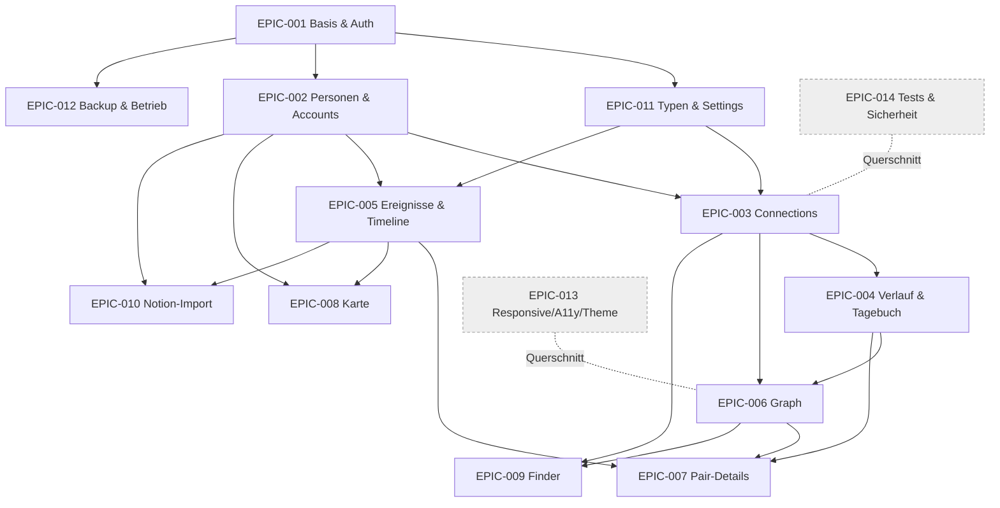

# 8. Dependency Map & kritischer Pfad

> ↩ [Index](README.md) · Epics: [02_epics.md](02_epics.md) · Phasen aus Prompt §9

## Phasenüberblick

| Phase | Inhalt | Liefert |
|---|---|---|
| 0 | Repository & technische Basis | Container, SQLite, CI, Health-Check |
| 1 | Auth & Stammdaten | Login, First-Run, Beziehungs-/Ereignistypen |
| 2 | Personen & Initialimport | Personen-CRUD, Accounts, Notion-Import |
| 3 | Connections & zeitliche Historie | Connection, Perioden, Regeln, Tagebuch |
| 4 | Ereignisse & Timeline | Events, Teilnehmer, Timelines |
| 5 | Graph | Haupt-/Fokus-Graph, Pair-Details |
| 6 | Karte & Finder | Karte, Layer, Cluster, Finder |
| 7 | Härtung & Betrieb | Backup/Restore, A11y, Security, Release |

## Abhängigkeitsgraph (Epics)

## Kritischer Pfad

`EPIC-001` → `EPIC-002` → `EPIC-003` (+ [Beziehungsregeln](07_beziehungsregeln.md)) → `EPIC-004` → `EPIC-006` → `EPIC-007`

Begründung: Auth/Datenmodell sind Fundament; **Connections + historisierte Perioden + Regeln** sind die fachlich anspruchsvollste Kette und Voraussetzung für Graph und die zentrale Pair-Detailansicht. Karte, Finder, Import und Theme hängen davon ab, sind aber nicht auf dem kritischen Pfad.

## Phase → Epic/Feature & Exit-Kriterien (Kurzfassung)

| Phase | Epics/Features | Wichtige Mockup-Freigaben | Migrationen | Exit-Kriterium |
|---|---|---|---|---|
| 0 | EPIC-001(4), EPIC-014(130) | – | Init-Schema | App startet im Container, Health grün, CI läuft |
| 1 | EPIC-001(1–3), EPIC-011 | SCR-001/002, Nav-Shell | AppUser, Settings, Typen | Login schützt alle Endpunkte; Setup einmalig |
| 2 | EPIC-002, EPIC-010 | Personen-Screens, Import | Person, SocialAccount, Location, ImportBatch/Map | Personen-CRUD + Import-Vorschau ohne Duplikate |
| 3 | EPIC-003, EPIC-004 | Beziehungsdialoge | Connection, Period, ChangeLog, Journal | Regeln durchgesetzt (Tests grün), Historie nie überschrieben |
| 4 | EPIC-005 | Ereignis/Timeline | Event, EventType, EventParticipant | Event in allen Teilnehmerprofilen; unscharfe Daten korrekt |
| 5 | EPIC-006, EPIC-007 | Graph + Pair-Details | (Graph-API, keine neue Tabelle) | 500 Nodes interaktiv; Kantenklick→Pair; Fokus<200 ms |
| 6 | EPIC-008, EPIC-009 | Karte, Finder | (Location-Nutzung) | Layer/Cluster; Finder korrekt + Leerzustand |
| 7 | EPIC-012/013/014 | Responsive/Fehlerzustände | – | Backup/Restore getestet; A11y- & Security-Checks; Release-Checkliste |

## Querschnitts-Epics

`EPIC-013` (Responsive/A11y/Theme) und `EPIC-014` (Tests/Sicherheit) laufen **in jeder Phase mit** – nicht am Ende „nachgezogen". Jede vertikale Scheibe ist responsive, getestet und zugriffsgeschützt, bevor sie als „done" gilt ([DoD](01_projektuebersicht.md#definition-of-done-projektebene)).
