# 1. User Flows (FLOW-01…27)

> ↩ [Index](README.md) · Features: [Landkarte](../review-1/03_feature-landkarte.md) · Regeln: [07](../review-1/07_beziehungsregeln.md)
> Jeder Flow: Kurzdiagramm + nummerierte Schritte + **Sonderfälle** (Abbrechen · Validierung · Leerzustand · Konflikt · Bestätigung).

---

## Einstieg & Auth

### FLOW-01 — First-Run-Setup · FEAT-001
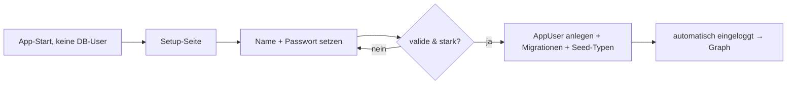
1. App erkennt: kein `AppUser` vorhanden → leitet auf `/setup`.
2. Eigentümer gibt Anzeigename + Passwort (+ Wiederholung) ein.
3. Passwortstärke wird geprüft; Hash via Argon2id.
4. `AppUser`, Standard-Beziehungs-/Ereignistypen (Seed) werden angelegt.
5. Direkt angemeldet, Weiterleitung auf Hauptgraph.
- **Sonderfälle:** Passwort zu schwach/ungleich → Inline-Fehler. Setup erneut aufrufen, wenn bereits ein User existiert → Redirect auf `/login` (Setup gesperrt).

### FLOW-02 — Anmeldung · FEAT-002/003
```mermaid
flowchart LR
  A[/login] --> B[Passwort eingeben]
  B --> C{korrekt?}
  C -- nein --> D[Fehler + Rate-Limit]
  C -- ja --> E[Session-Cookie, Redirect Ziel/Graph]
```
1. Aufruf geschützter Route ohne Session → Redirect `/login` (Zielroute gemerkt).
2. Passwort eingeben → Server prüft Hash.
3. Erfolg: HttpOnly-Session-Cookie, Redirect auf gemerkte Zielroute.
- **Sonderfälle:** Falsch → generische Fehlermeldung + Verzögerung/Rate-Limit (kein Userenum). Logout verwirft Session. Abgelaufene Session → erneut `/login`.

---

## Personen

### FLOW-03 — Person anlegen · FEAT-013/010
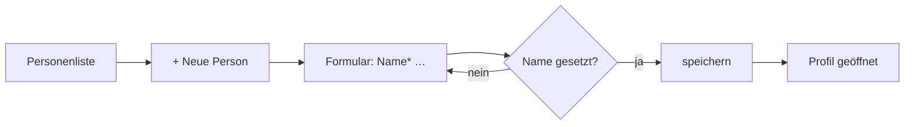
1. In Personenliste „Neue Person".
2. Name (Pflicht), optional Geburtsdatum, Geschlecht (M/W/divers), Notizen, Ort, Bild, Accounts.
3. Speichern → Validierung serverseitig → Profil.
- **Sonderfälle:** Abbrechen verwirft Eingaben (mit Rückfrage bei ungespeicherten Änderungen). Name leer → Inline-Fehler. Leere Liste vorher → Empty-State mit CTA.

### FLOW-04 — Person mit lokalem Profilbild · FEAT-015
1. Im Formular „Bild hochladen" → Datei wählen.
2. Client prüft Typ/Größe → Vorschau.
3. Upload beim Speichern; Pfad in `ProfileImagePath`.
- **Sonderfälle:** Falscher Typ/zu groß → Fehler, kein Upload. Upload-Fehler → Eintrag speicherbar ohne Bild.

### FLOW-05 — Person mit externer Bild-URL · FEAT-015
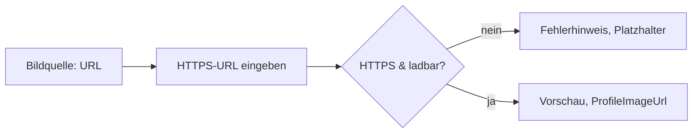
1. „Externe URL" wählen, HTTPS-URL eingeben.
2. Schema-Prüfung (nur https) + Vorschau-Laden.
3. Erfolg → `ProfileImageUrl`.
- **Sonderfälle:** Nicht-HTTPS/unerreichbar/kein Bild → klarer Fehler + neutraler Platzhalter; Speichern bleibt möglich.

### FLOW-06 — Social Account ergänzen · FEAT-016
1. Im Profil „Account hinzufügen".
2. Plattform, Handle, optional URL/Sichtbarkeit.
3. Speichern; Duplikatprüfung (Plattform+Handle).
- **Sonderfälle:** Duplikat → Warnung (anlegen oder abbrechen). Account entfernen → Bestätigung.

---

## Connections & Beziehungen

### FLOW-07 — Connection erstellen · FEAT-020
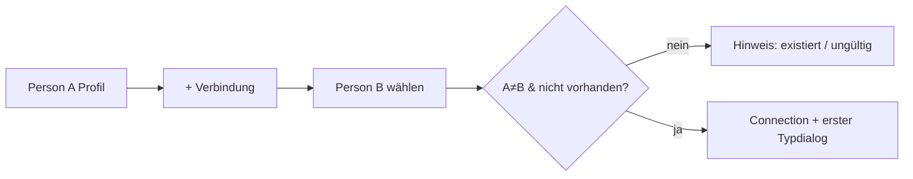
1. Von Profil/Graph „Verbindung erstellen".
2. Zweite Person wählen.
3. Prüfung: nicht dieselbe Person, Paar existiert noch nicht (kanonisch).
4. Connection anlegen → direkt Typ-/Nähegrad-Dialog (FLOW-08).
- **Sonderfälle:** Selbstkante → blockiert. Paar existiert → Hinweis + Sprung zu bestehender Pair-Detail. Abbrechen verwirft.

### FLOW-08 — Nähegrad hoch-/herabstufen · FEAT-021/022 · [Regeln](../review-1/07_beziehungsregeln.md)
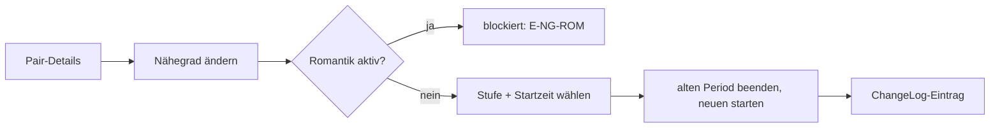
1. In Pair-Details „Nähegrad ändern".
2. Zielstufe (Bekanntschaft/Freundschaft/Enge Freundschaft/kein) + Startzeitpunkt (auch unscharf).
3. Aktiver Nähegrad-Period wird zum Startzeitpunkt beendet, neuer gestartet; ChangeLog.
- **Sonderfälle:** Romantik aktiv → Aktion deaktiviert + Erklärung (E-NG-ROM). Enddatum < Start → E-TIME-ORDER. Abbrechen ohne Änderung.

### FLOW-09 — Freundschaft Plus beginnen/beenden · FEAT-023
1. Pair-Details „Freundschaft Plus" → beginnen/beenden + Zeitpunkt.
2. Period startet/endet parallel zum Nähegrad.
- **Sonderfälle:** Romantik aktiv → blockiert (E-FP-ROM). Bereits aktiv → nur „beenden" angeboten.

### FLOW-10 — Sex als separates Ereignis · FEAT-042/040 · DEC-027
1. Aus Pair-Details/Ereignisliste „Ereignis hinzufügen" → Typ `Sex`.
2. Datum (auch unscharf), Teilnehmer (mind. die zwei), optional Ort/Notiz.
3. Speichern → erscheint als Event; **kein** Statuswechsel.
- **Sonderfälle:** Sensibel → in Listen/Timeline standardmäßig versteckt (Toggle nötig). Kein Teilnehmer → blockiert.

### FLOW-11 — Romantische Beziehung beginnen · FEAT-024
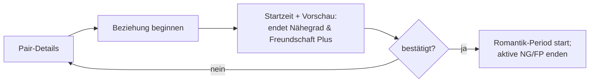
1. „Romantische Beziehung beginnen" + Startzeitpunkt.
2. **Vorschau** zeigt, welche Status automatisch enden (Nähegrad, Freundschaft Plus).
3. Bestätigen → Romantik-Period startet; betroffene Perioden enden; parallele Kontexte (Cosplay/Business) bleiben.
- **Sonderfälle:** Bereits romantisch → nur „beenden". Abbrechen = keine Änderung.

### FLOW-12 — Romantik beenden + Folgestatus · FEAT-025 · DEC-009
```mermaid
flowchart LR
  A[Beziehung beenden] --> B[Endzeit]
  B --> C[Pflicht: Folge-Nähegrad wählen]
  C --> D[Optional: Ex-Partner/in?]
  D --> E{vollständig?}
  E -- nein --> C
  E -- ja --> F[Romantik enden;\nFolge-Period(s) starten]
```
1. „Beziehung beenden" + Endzeitpunkt.
2. **Pflichtdialog:** Folge-Nähegrad (Bekanntschaft/Freundschaft/Enge Freundschaft/kein).
3. Optional `Ex-Partner/in` aktivieren (paralleler Folgestatus).
4. Bestätigen → Romantik endet; gewählte Folge-Perioden starten.
- **Sonderfälle:** Dialog unvollständig → kein Speichern (E-ROM-END-INCOMPLETE). Abbrechen = Romantik bleibt aktiv.

### FLOW-13 — Tagebucheintrag erfassen · FEAT-032
1. Pair-Details „Tagebucheintrag".
2. Datum (auch unscharf), Titel, optional Notiz.
3. Speichern → chronologisch einsortiert.
- **Sonderfälle:** Titel leer → Fehler. Bearbeiten/Löschen einzeln, ohne andere Einträge zu verändern; Löschen mit Bestätigung.

---

## Ereignisse & Timeline

### FLOW-14 — Ereignis mit 1..n Personen · FEAT-040/041
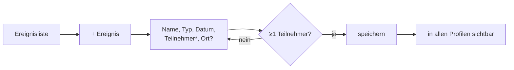
1. „Neues Ereignis" → Name, Typ, Datum (auch unscharf).
2. Teilnehmer hinzufügen (mind. 1), optional Ort/Notiz.
3. Speichern → erscheint in allen Teilnehmerprofilen & Timelines.
- **Sonderfälle:** 0 Teilnehmer → blockiert. Sensibler Typ → Filterregel DEC-027. Abbrechen verwirft.

### FLOW-15 — Globale Timeline filtern · FEAT-044
1. Timeline öffnen → Filter Zeitraum/Ereignistyp/Person.
2. Ergebnis chronologisch; unscharfe Daten korrekt gruppiert.
- **Sonderfälle:** Sensible Inhalte nur mit aktivem Toggle. Kein Treffer → Empty-State. Filter zurücksetzen.

### FLOW-16 — Personen-Timeline · FEAT-045
1. Im Profil „Timeline" → Ereignisse + Beziehungswechsel der Person, chronologisch.
- **Sonderfälle:** Keine Daten → Empty-State; Sensible über Toggle.

---

## Graph

### FLOW-17 — Hauptgraph bedienen · FEAT-050/051
1. Graph öffnen → Zoom/Pan/Auswahl; Kantenfarbe = aktueller Typ; Legende.
- **Sonderfälle:** Viele Nodes → Clustering/Reduktion. Keine Daten → Empty-State mit CTA „Person anlegen".

### FLOW-18 — Profil über einfachen Klick · FEAT-052
1. Einfacher Klick/Tap auf Node → Profilpanel (kein Fokuswechsel).
- **Sonderfälle:** Klick ins Leere schließt Panel. Tastatur: Fokus + Enter öffnet Panel.

### FLOW-19 — Person per Doppelklick fokussieren · FEAT-053/054
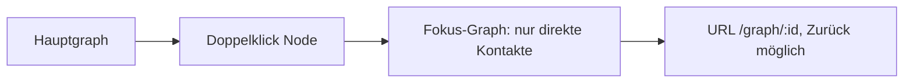
1. Doppelklick/Doppeltap → fokussierter Graph (Tiefe 1), Person zentriert/hervorgehoben.
2. URL ändert sich (Deep-Link); Browser-Zurück stellt Kontext wieder her.
- **Sonderfälle:** Isolierte Person → nur Node sichtbar + Hinweis. Sichtbare „Fokussieren"-Aktion zusätzlich zum Doppelklick.

### FLOW-20 — Mobile Aktionen (Long-Press + sichtbare Alternative) · FEAT-055
1. Long-Press auf Node → Aktionsmenü (Profil, Fokus, Verbindung…).
2. Dieselben Aktionen zusätzlich über sichtbaren „⋯"-Button.
- **Sonderfälle:** Keine Hover-only-Funktionen; alle Aktionen per Tap erreichbar.

### FLOW-23 — Im Fokus-Graph zu direktem Kontakt wechseln · FEAT-053
1. Im Fokus-Graph anderen Node doppelklicken → Fokus wechselt ohne Seitenneustart; URL aktualisiert.
- **Sonderfälle:** Zurück-Aktion/Browser-Zurück geht Schritt zurück.

---

## Pair-Detailansicht

### FLOW-21 — Pair-Details über Kantenklick öffnen · FEAT-060
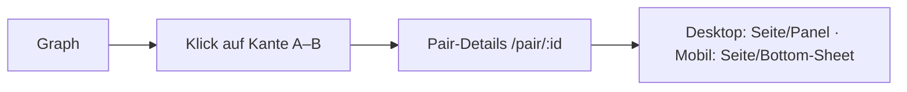
1. Klick/Tap auf Verbindungslinie → Pair-Details des Paars.
2. Anzeige: beide Personen, aktuelle+historische Typen+Zeiträume, Tagebuch, gemeinsame Timeline/Events, Aktionen.
- **Sonderfälle:** Mehrere parallele Typen → Auswahl/Liste. Mobil als eigene Seite/Bottom-Sheet mit sichtbarem Zurück.

### FLOW-22 — Gemeinsame Ereignisse eines Paars filtern · FEAT-063/064 · DEC-022
1. In Pair-Details Filter: Zeitraum/Eventtyp/Beziehungstyp + Umschalter **„alle gemeinsamen"** vs. **„nur exakt diese zwei"**.
2. „nur exakt diese zwei" = Events mit genau diesen beiden Teilnehmern.
- **Sonderfälle:** Kein Treffer → Empty-State. Sensible nur mit Toggle (DEC-027).

---

## Karte, Finder, Import, Betrieb

### FLOW-24 — Orte auf Karte filtern · FEAT-070…074 · DEC-025
1. Karte öffnen → Layer Personen/Ereignisse einzeln schaltbar; Clustering.
2. Marker wählen → Detail (Name/Bild + Link).
- **Sonderfälle:** Fehlender Standort → nicht verortet, separat gelistet. Nur Stadt/Region → grobe Position, nie präziser als gespeichert.

### FLOW-25 — Gemeinsame direkte Kontakte finden · FEAT-080/081
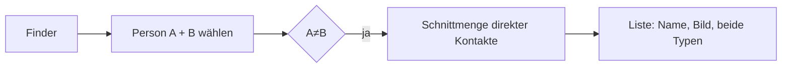
1. Zwei Personen wählen → gemeinsame direkte Kontakte.
2. Ergebnis mit beiden Beziehungstypen; Wechsel in Profil/Fokus-Graph.
- **Sonderfälle:** Gleiche Person zweimal → blockiert. Kein Treffer → Empty-State.

### FLOW-26 — Notion-Import (Vorschau → Ausführung) · FEAT-090…093 · DEC-024
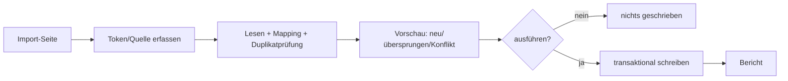
1. Notion-Zugang sicher erfassen.
2. Lesen, Mapping, Duplikatabgleich (ExternalImportMap).
3. **Vorschau** zeigt neu/übersprungen/Konflikte.
4. Bestätigen → transaktionaler Schreibvorgang → Importbericht.
- **Sonderfälle:** Abbruch vor Bestätigung = keine Daten geschrieben. Wiederholter Import = keine Duplikate. Fehler einzelner Datensätze → im Bericht, Rest läuft.

### FLOW-27 — Backup & Restore nachvollziehen · FEAT-110/111 · DEC-031
1. Einstellungen → Backup → Paket (DB + Uploads) erzeugen/herunterladen.
2. Restore-Verfahren dokumentiert; Wiederherstellung führt zu identischem Stand.
- **Sonderfälle:** Niedrige Priorität (DEC-031). Restore-Test Teil der Abnahme (RISK-016).

---

### Flow → Feature/Screen-Matrix (Kurz)
| Flow | Features | Screens (Review 3) |
|---|---|---|
| 01–02 | FEAT-001/002/003 | SCR-001/002 |
| 03–06 | FEAT-010/013/015/016 | Personen |
| 07–12 | FEAT-020…025 | Beziehungsdialoge |
| 13 | FEAT-032 | Pair-Details |
| 14–16 | FEAT-040/041/044/045 | Ereignisse/Timeline |
| 17–20,23 | FEAT-050…055 | Graph |
| 21–22 | FEAT-060…064 | Pair-Details |
| 24 | FEAT-070…074 | Karte |
| 25 | FEAT-080/081 | Finder |
| 26 | FEAT-090…093 | Import |
| 27 | FEAT-110/111 | Backup |
